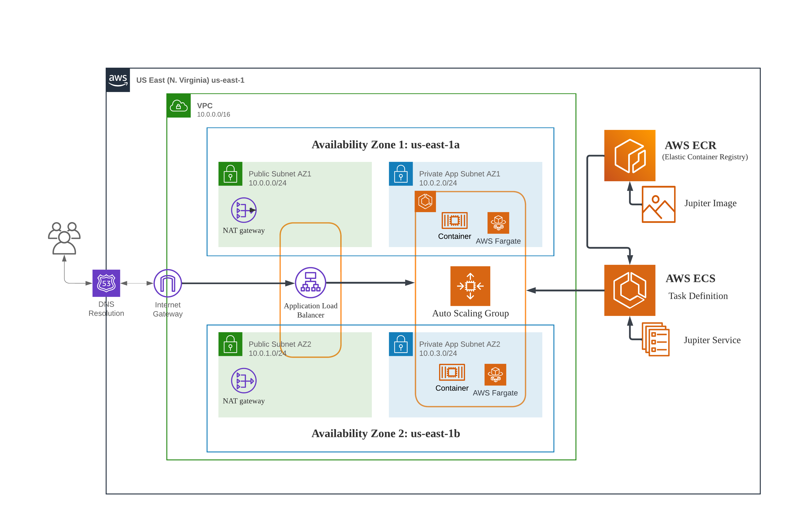

# AWS - Host static website using Elastic Container Service (ECS)

## Overview
In this Lab, we are going to develop a static website and deploy it using AWS Elastic Container Service. The architecture comprises the following components and services to ensure high availability and fault tolerance:


## Prerequisites
- Have basic <b>Docker</b> knowledge
- Have basic <b>AWS</b> knowledge

## Get Started

### 1- Create and clone Github Repository 
1) Go to the GitHub website: https://github.com/ and sign in to your account.
2) Click the New repository button in the upper-right corner of the page.
3) Give your repository a name and a description.
4) Select the visibility of your repository. You can choose to make it public or private.
5) Select whether you want to initialize your repository with a README file.
6) Click the Create repository button.
7) Clone the Repository to Your Local Machine

### 2- Create Dockerfile
1) In your project directory, create a new file and name it Dockerfile (without any extension). Make sure your text editor doesn't automatically add a .txt extension.
2) Add the below to your Dockerfile
    ```console
    FROM amazonlinux:latest

    # Install dependencies
    RUN yum update -y && \
        yum install -y httpd && \
        yum search wget && \
        yum install wget -y && \
        yum install unzip -y

    # change directory
    RUN cd /var/www/html

    # download webfiles
    RUN wget https://github.com/azeezsalu/jupiter/archive/refs/heads/main.zip

    # unzip folder
    RUN unzip main.zip

    # copy files into html directory
    RUN cp -r jupiter-main/* /var/www/html/

    # remove unwanted folder
    RUN rm -rf jupiter-main main.zip

    # exposes port 80 on the container
    EXPOSE 80

    # set the default application that will start when the container start
    ENTRYPOINT ["/usr/sbin/httpd", "-D", "FOREGROUND"]
    ```

### 3- Build the Docker Image
1) Open your CLI, and navigate to the directory containing your Dockerfile using the cd command.
2) Once you're in the correct directory, you can build the Docker image using the docker build command followed by -t and the name (and optionally, a tag) you want to give to your Docker image. Let's name the image `jupiter`. 
    ```console
    $ docker build -t jupiter .
    ```
To confirm that your Docker image was created successfully, you can list all Docker images on your machine using the `$ docker images` command. You should see your new image listed with the name you assigned it.

### 4- Run the Docker Container
```console
docker run -dp 80:80 jupiter
```

### 5- Test the container
You can visit the Jupiter website by opening your web browser and navigating to http://localhost:80. 
This will allow you to access and interact with the Jupiter application deployed within the Docker container.

### 6- Create a Repository in ECR
To create a repository in Amazon Elastic Container Registry (ECR), follow these steps:

1) Open the Amazon ECR console at https://console.aws.amazon.com/ecr/.
2) In the navigation pane, choose "Repositories"
3) Click the "Create repository" button.
4) Provide a unique repository name, such as "jupiter" for your ECR repository.
5) Optionally, add tags or configure repository settings as needed.
6) Click the "Create repository" button to create your ECR repository.

### 7- Push the Docker image to ECR
To push the "jupiter" image to Amazon ECR, follow these steps:
1) Create an IAM User with Programmatic Access:
    - Create an IAM user in the AWS Management Console
    - Ensure the user has Administrator Access permissions
2) Generate an Access Key for the IAM User:
    - Locate the IAM user for whom you want to generate an  access key and click on their username.
    - In the "Security credentials" tab, you will see the "Access keys" section. Click on the "Create access key" button.
    - A dialog box will appear displaying the newly generated access key and secret access key. You can click on the "Show access key" link to view the access key. Note that the secret access key will only be shown once, so make sure to securely store it.
    - Click on the "Download .csv" button to download a CSV file containing the access key details.
3) Configure the AWS CLI to use the access key:
    - Install the AWS CLI: If you haven't already installed the AWS CLI, you can follow the installation instructions provided by AWS for your operating system. The instructions can be found at: https://aws.amazon.com/cli/
    - Open a terminal or command prompt on your local machine.
    - Run the following command to configure the AWS CLI:
        ```console
        $ aws configure
        ``````
    - Enter the access key ID when prompted and press Enter.
    - Enter the secret access key when prompted and press Enter.
    - Specify the default region name for your AWS resources. For example, you can enter "us-east-1" for the US East (N. Virginia) region. Press Enter.
    - Specify the default output format. You can choose from options like "json", "text", or "table" Enter your desired option and press Enter.
    - Once you have completed these steps, your AWS CLI is configured to use the access key for authentication. You can now use the AWS CLI commands to interact with your AWS resources.
4) Push the Docker image to your ECR:
    - Log in to your ECR registry using the AWS CLI by running the following command:
        ```console
        $ aws ecr get-login-password --region <region> | docker login --username AWS --password-stdin <account-id>.dkr.ecr.<region>.amazonaws.com
        ```
        Replace <region> with the AWS region where your ECR repository is located and <account-id> with your AWS account ID. This command retrieves an authentication token and logs you in to the ECR registry.
    - Tag the "jupiter" Docker image with the ECR repository URI. Run the following command:
        ```console
        $ docker tag jupiter:latest <account-id>.dkr.ecr.<region>.amazonaws.com/<repository-name>:latest
        ```
        Replace <account-id> with your AWS account ID, <region> with the AWS region, and <repository-name> with the name of your ECR repository.
    - Push the Docker image to the ECR repository by executing the following command:
        ```console
        $ docker push <account-id>.dkr.ecr.<region>.amazonaws.com/<repository-name>:latest
        ```
        Again, replace <account-id> with your AWS account ID, <region> with the AWS region, and <repository-name> with the name of your ECR repository.
        Wait for the Docker image to be pushed to the ECR repository. The progress will be displayed in the terminal.
        Once the push is completed, your "jupiter" Docker image will be available in your ECR repository. You can now use it for your AWS deployments.

### 8- Create the VPC:
To accomplish this, please refer to the guide provided in the repository located at https://github.com/RoyGeagea/aws-dynamic-website. Follow the instructions up to Step 9, and disregard the creation of the data layer as it is unnecessary for our project.

### 9- Create the security groups
Properly configuring security groups is crucial to maintain the security and integrity of your AWS VPC. In this section, I will guide you through the steps to create and configure security groups for various components within your infrastructure.

1) Creating an ALB Security Group:
    - Open the AWS Management Console and navigate to the Amazon EC2 service.
    - Click on "Security Groups" in the navigation pane and select "Create Security Group"
    - Provide a name for the security group, such as "ALBSecurityGroup"
    - Add inbound rules to allow HTTP (port 80) and HTTPS (port 443) traffic from anywhere (0.0.0.0/0) for the ALB.
    - Save the changes to create the ALB security group.
3) Creating a ECS Security Group:
    - Repeat the steps to create another security group named "ECSSecurityGroup"
    - Add inbound rules to allow HTTP (port 80) and HTTPS (port 443) traffic from the ALB security group.
    - Save the changes to create the web server security group.

### 10- Create Application Load Balancer
To create an Application Load Balancer (ALB) and the associated target groups, follow these steps:
1) Open the Amazon EC2 service.
2) In the navigation pane, under "Load Balancers", select "Target Groups"
3) Click the "Create target group" button.
4) Provide a name for your target group, such as "jupiter-target-group".
5) Configure the target group settings based on our requirements
6) Click "Create" to create the target group.
7) Next, to create the ALB, go back to the EC2 service dashboard and select "Load Balancers" in the navigation pane.
8) Click the "Create Load Balancer" button.
9) Select "Application Load Balancer" as the load balancer type.
10) Configure the ALB settings, such as name, listeners, security groups, and availability zones.
11) In the "Configure Routing" section, select "Existing target group" and choose the previously created target group ("jupiter-target-group").
12) Complete the remaining configuration steps, such as tags, and review the settings.
13) Click "Create" to create the ALB.

### 11- Delete the target group
Perhaps you're wondering why this is necessary? Well, in order to create an Application Load Balancer, it is essential to establish a corresponding target group. However, at present, we have not yet set up our ECS environment to create the correspondent target group. Consequently, we need to remove the existing target group. To accomplish this, please follow the subsequent steps:
1) Go back to the Load balancers page under EC2 service.
2) Remove the listener from the ALB that is associated with the target group you want to delete.

### 12- Create Fargate ECS Cluster
To create a Fargate ECS cluster, follow these steps:
1) Open the Amazon ECS service.
2) In the navigation pane, under "Clusters", click the "Create Cluster" button.
3) Provide a name for your cluster, such as "jupiter-cluster".
4) In networking section, select your VPC and the private app subnets you created before.
5) Under "Infrastructure" section, select "AWS FARGATE (serverless)".
6) Review the other cluster configuration options and make adjustments if necessary.
7) Click the "Create" button to create the ECS cluster.

### 13- Create ECS Task Definition
To create an ECS Task Definition using the "jupiter" ECR URI and the Fargate launch type, follow these steps:
1) Open the Amazon ECS service.
2) In the navigation pane, under "Task Definitions", click the "Create new Task Definition" button.
3) Provide a name such as "jupiter-task-definition".
4) Provide a name for the container, such as "jupiter-container"
5) Specify the ECR URI for the "jupiter" Docker image in the "Image" field. 
6) Configure the other settings, for container port choose 80
7) When you finish, scroll to the bottom then click next
8) For App environment, Select the launch type compatibility as "Fargate" and click "Next"
9) Under "Task execution role", AWS can create one for you, just click the dropdown and select "Create new role". The new role will have the below policy:
    ```json
    {
    	"Version": "2012-10-17",
    	"Statement": [{
    		"Effect": "Allow",
    		"Action": [
    			"ecr:GetAuthorizationToken",
    			"ecr:BatchCheckLayerAvailability",
    			"ecr:GetDownloadUrlForLayer",
    			"ecr:BatchGetImage",
    			"logs:CreateLogStream",
    			"logs:PutLogEvents"
    		],
    		"Resource": "*"
    	}]
    }
    ```
10) Configure the task definition details as needed, such as CPU and memory requirements, networking, logging, and other container-level configurations.
11) Review the task definition settings and configurations.
12) Click the "Create" button to create the ECS task definition.

### 14- Create the ECS Service
To create an ECS Service and start the container using the previously created ALB, follow these steps:
1) Open the Amazon ECS service.
2) In the navigation pane, under "Clusters", select the cluster you created.
3) Click the "Create" button to create a new service.
4) Select Launch type
5) In the "Launch type" section, select "Fargate".
6) Under "Task Definition", select the task definition you created earlier, for Revision select 1
7) For Service name, use "jupiter-ecs-service"
8) In the "Cluster VPC" section, select the VPC created before.
9) In the "Subnets" section, select the private application subnets where your ECS tasks will be deployed.
10) In the "Security groups" section, select the appropriate security group(ECSSecurityGroup) that allow inbound traffic from the ALB.
11) In the "Load balancer type" section, choose "Application Load Balancer".
12) In the "Load balancer name" field, select the ALB you previously created.
13) Configure the listener and target group settings based on the application's requirements.
14) Specify any additional service settings like desired task count, deployment settings, and load balancer health check settings.
15) Review the service configuration and click the "Create" button to create the ECS service.

Once created, the ECS service will start running the container using the specified task definition and integrate it with the ALB. It will distribute incoming traffic to the container instances running in the private application subnets.

### 15- Test the service
You can now proceed to test the website by utilizing the DNS name of the Application Load Balancer

## Summary

The AWS project involved building and deploying a containerized application using Docker and various AWS services. The project included creating a Docker image, pushing it to an Amazon ECR repository, setting up an Application Load Balancer (ALB) for load balancing, creating an ECS cluster using Fargate, defining an ECS task for the containerized application, and creating an ECS service for managing and scaling the container instances. This setup allowed for efficient deployment, load balancing, and scalability of containerized applications in a secure and scalable manner within the AWS environment


